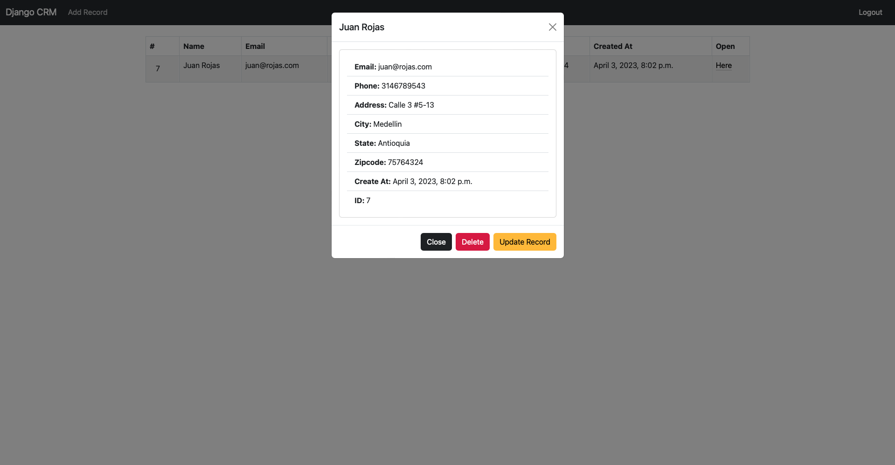

# Python - CRM_App

  

  

## Introduction
CRM_App is a Django web application for customer management. The application provides a dashboard for viewing customer information.

## Mockup

## Installation

## Usage

## Bugs

## Styling
